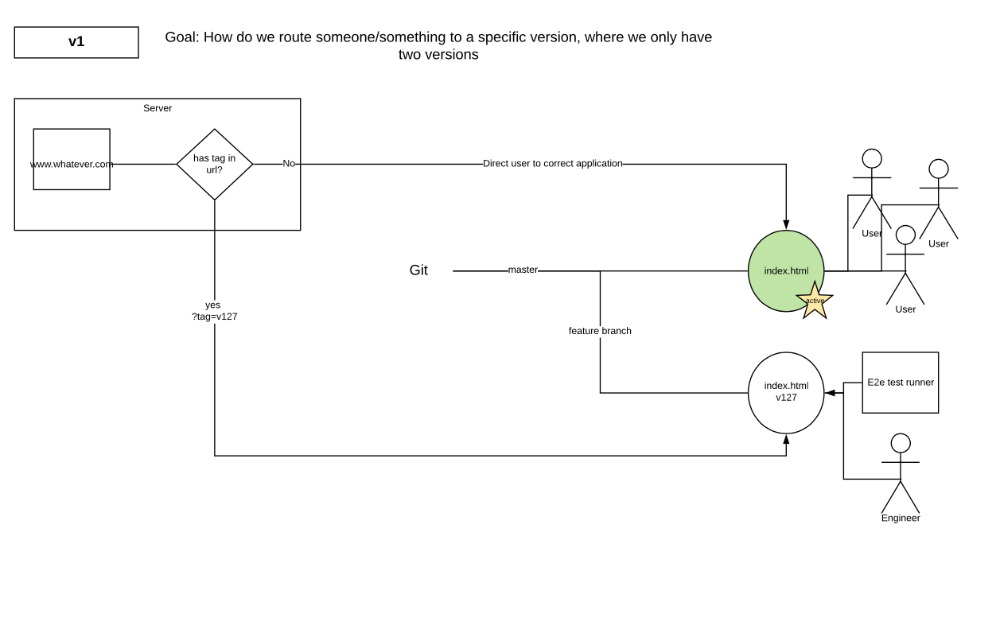
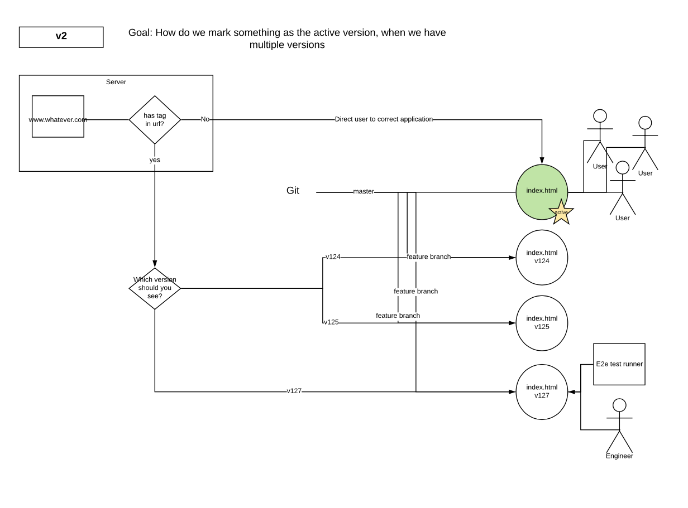
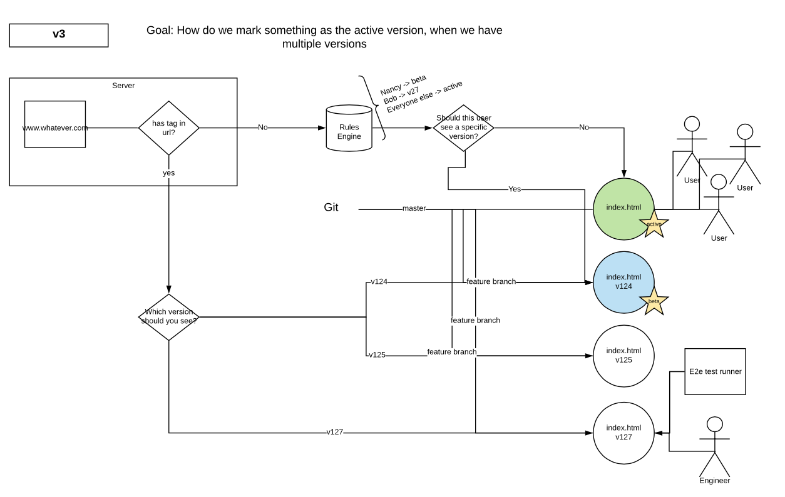

# The Dos Equis Project Hackathon 

## The project

### Problem statement:
Releasing new code to our customers is a slow process. Currently we have 3 environments (including 2 staging environments) 
that are on our path to Production. These staging environments have high contention and are less stable.
Our proposal is to look at separating deployment and release.

Note: there is a team that will tackle this but we feel it would be interesting to see how multiple teams might tackle it

#### Expanded problem statement: 
Currently UI applications have to be built and then deployed through 3 environments, two staging environments and then to 
production. Testing in complicated by staging environments being less stable than production resulting in test failures 
due to service degradation, outage or errors. These add considerable time to our build and deploy procedures. 

UI applications generally only need to be built once. UI performance testing does not require a deployed scaled environment.
Functional testing against production services would be more stable.  

We propose to separate the deployment and release process. All versions on the UI application would be deployed to 
production, testing could then be done post deployment against production services and infrastructure. Once we were happy 
with a version of the UI application it could be tagged as the live version and users could be directed to it. 

We have some diagrams that describe the rough user flow and iterative architectures. The diagrams are available [here](https://www.lucidchart.com/invitations/accept/d1cc8c97-3e2f-4d94-ba37-91add859ff16) on Lucid Chart.

### Open Questions: 
How do we handle merges? 
How do we not accidentally delete useful code from version 124 - 126?

### Non technical/hackathon questions: 
Would we need to deploy the UI to other environments to satisfy other stakeholders. We would need to be able to run tests 
in parallel. We would need to be able to setup and clean down testing data so as not to bloat prod servers (we do this now)

### Notes:
For demos and locked sites, this could be utilised to test against certain versions and allow engineering to continue to 
release either to other customers or for testing
CSI/issue resolution - specific fixes could be tested by support and/or customers before deploying
Product/design review

## Ways of working

We are using a project board on this repo to track issues, you can access it [here](https://scm.eng.hmhco.com/deroistec/dos-equis-project/projects/1)

### Norms

* We will keep a phone line open in Dublin so people can drop in and out. We will try Webex first and fall back to 
something else if it doesn’t work.
* We will over communicate online so as to ensure those not in the room are kept in the loop.
* We will document in the code base - i.e. md files along side code.
* We will use the project board in this github repo for planning and issue tracking. See above.
* We will branches and PRs just so we don’t get in each others way.

